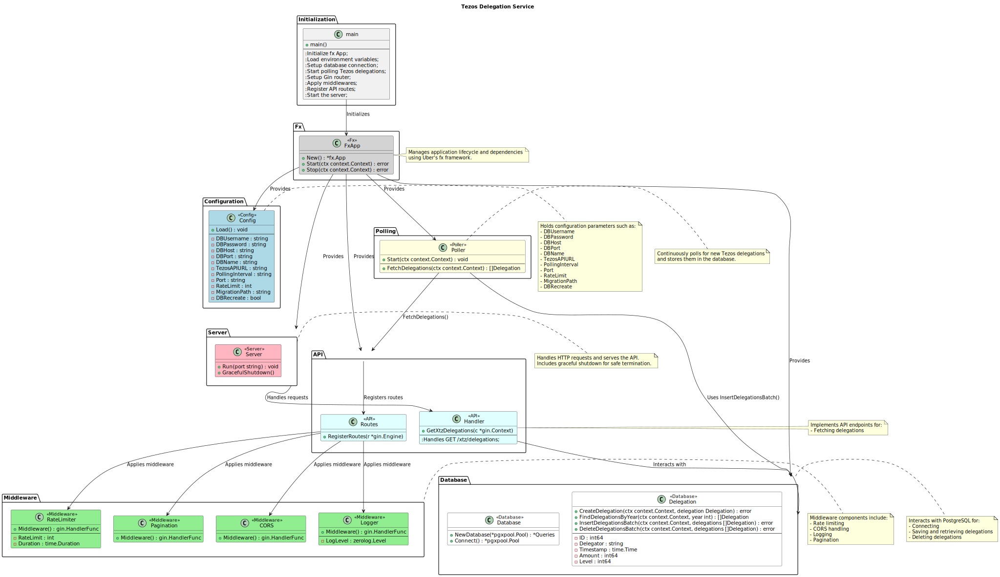

# Presentation 

## Overview

This project layout follows a structured and modular approach that enhances `readability`, `maintainability`, and `extensibility`. By organizing the project in a clear and logical manner, it becomes easier for developers to navigate, understand, and extend the codebase.



## Requirements 

### apt packages

- docker
- docker-compose

others:
- postgres-client 
- make 
- curl
- jq

```sh
sudo apt install postgresql-client make curl jq
```

### go binaries

- oapi-codegen (optional for run)
```go
go install github.com/oapi-codegen/oapi-codegen/v2/cmd/oapi-codegen@latest
```

- sqlc (optional for run)
```go
go install github.com/sqlc-dev/sqlc/cmd/sqlc@latest
```

## Run it 

- Variables are already set in .env file.

- Launch postgresql: 

```sh
cd tezos-delegation-service
docker-compose up -d 
``` 

- Apply migrations: 
```sh
make up
``` 

- Run the server:
```sh
make run
``` 

- Curl request with a year: 

```sh
curl -X GET "http://127.0.0.1:8080/xtz/delegations?year=2018"      -H "Content-Type: application/json"
```

- Curl request without a year: 

```sh
curl -X GET "http://127.0.0.1:8080/xtz/delegations"      -H "Content-Type: application/json"
```

### testing 

- Create a test database: 
```sh
make test-db
```
- Apply migrations: 
```sh
make test-up
``` 

- run tests:
```go
go test ./...
```


## Project Structure

```
├── cmd
│   └── server
│       └── main.go
├── config
│   └── config.go
├── coverage.html
├── coverage.out
├── db
│   ├── migrations
│   │   ├── 000001_delegations.down.sql
│   │   └── 000001_delegations.up.sql
│   ├── queries
│   │   └── queries.sql
│   └── sqlc.yaml
├── docker-compose.yml
├── docs
│   ├── index.html
│   └── plantuml_delegation_service.svg
├── go.mod
├── go.sum
├── internal
│   ├── api
│   │   ├── handlers
│   │   ├── openapi.gen.go
│   │   ├── router
│   │   └── server
│   ├── app
│   │   ├── app.go
│   │   └── app_test.go
│   ├── db
│   │   ├── db.go
│   │   ├── models.go
│   │   ├── postgres.go
│   │   ├── postgres_test.go
│   │   ├── querier.go
│   │   └── queries.sql.go
│   ├── middleware
│   │   ├── cache.go
│   │   ├── circuitbreaker.go
│   │   ├── cors.go
│   │   ├── logger.go
│   │   ├── manager.go
│   │   ├── ratelimiter.go
│   │   └── retrier.go
│   ├── parser
│   │   ├── parser.go
│   │   └── parser_test.go
│   └── poller
│       ├── poller.go
│       └── poller_test.go
├── logger
│   └── logger.go
```